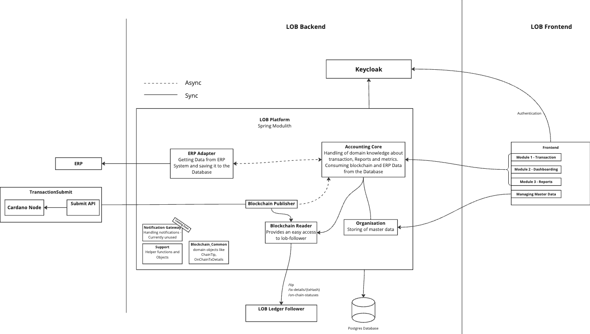

<div align="center">
  <hr />
  <h1 align="center" style="border-bottom: none">Ledger on the Blockchain | Cardano Foundation</h1>

[](https://github.com/cardano-foundation/cardano-wallet/blob/master/LICENSE)
[](https://conventionalcommits.org)


[](https://app.fossa.com/projects/custom%2B45571%2Fgithub.com%2Fcardano-foundation%2Fcf-lob-platform?ref=badge_shield&issueType=license)
[](https://sonarcloud.io/summary/new_code?id=cardano-foundation_cf-lob-platform)

[](https://github.com/cardano-foundation/cf-lob/actions/workflows/build.yml)
[](https://github.com/cardano-foundation/cf-lob/actions/workflows/build-with-tests.yaml)


<hr />
</div>
In a time where trust and transparency hold paramount importance, blockchain emerges as a powerful solution, enabling a fundamental transformation in financial data management. 
Reeve, also known as Ledger on the Blockchain (LOB), empowers organizations to securely record and share critical financial data on the Cardano blockchain, ensuring its integrity and verifiability for all stakeholders. 

## Project Overview
The LOB platform is designed to integrate traditional accounting systems with blockchain technology, ensuring transparency, immutability, and enhanced security for financial records. By leveraging the Cardano blockchain, the platform offers a decentralized approach to financial data management, facilitating trust and efficiency in accounting processes.

### Key Features
- **Streamlined Audits:** Simplifies the audit process by providing a single source of truth for financial information
- **Strengthened Accountability:** Creates an immutable and transparent record of all financial activities, holding accountable for their actions and decisions
- **Increased Trust:** Instills confidence in stakeholders regarding the accuracy and reliability of financial information, strengthening relationships and promotin collaboration
- **Improved Efficiency:** Reduces the cost and complexity of managing financial data, freeing ressources for innovation and growth initiatives.
- **Modular Software Architecture:** Facilitates scalability and extensibility, allowing for the integration of additional features and functionalities as needed

## Repository Structure
The repository is organized into several modules, each responsible for specific functionalities within the platform:

- **Accounting Reporting Core:** This module serves as the core component for accounting and reporting functionalities. It manages the processing and generation of financial reports, ensuring data integrity and compliance with accounting standards.
- **Blockchain Common:** Contains shared utilities and configurations for blockchain interactions. This module provides common interfaces and services that facilitate communication with the Cardano blockchain, ensuring consistency across different components.
- **Blockchain Publisher:** Responsible for publishing financial transactions and reports to the blockchain. It ensures that all relevant data is accurately and securely recorded on the decentralized ledger.
- **Blockchain Reader:** Handles the retrieval and reading of data from the blockchain. This module allows other components to access and verify financial records stored on the blockchain, supporting transparency and auditability.
- **Netsuite Altavia ERP Adapter:** An adapter designed to integrate the LOB platform with NetSuite Altavia ERP systems. It facilitates seamless data exchange between the ERP and the blockchain, ensuring synchronization of financial information.
- **Organisation:** Manages organizational data and structures within the platform. This module handles information related to different entities, departments, and roles, ensuring proper access control and data management.
- **Support:** Provides support utilities and services for the platform. This includes logging, error handling, and other auxiliary functions that enhance the platform's robustness and maintainability.
- **_backend-services/cf-lob-ledger-follower-app:** A backend service responsible for monitoring the blockchain ledger. It tracks new transactions and updates, ensuring that the platform remains synchronized with the latest state of the blockchain.

- **Notification Gateway (Coming soon):** Manages the notification system within the platform. It handles the dispatching of alerts and notifications to users or other systems based on specific events or triggers within the LOB platform.

## Architecture
This repository uses [Spring Modulith](https://github.com/spring-projects/spring-modulith) architecture to organize the codebase into modules. The architecture is designed to promote modularity, scalability, and maintainability, allowing for the independent development and deployment of different components.
Through the use of modules it is possible to split the architecture into different layers, each responsible for specific functionalities within the platform. This separation of concerns enables better code organization, easier testing, and improved code reuse across different components.


## How to build
This project uses Gradle as the build tool. To build the project, follow these steps:
```
git clone git@github.com:cardano-foundation/cf-lob-platform.git
cd cf-lob-platform
./gradlew clean build
```

## Documentation

| Link                                                                                        | Audience   |
|---------------------------------------------------------------------------------------------|------------|
| [On-chain Format](docs/onChainFormat.md)                                                    | Developers |
| [Dataflow within the System](docs/dataflow.md)                                              | Developers |
| [Code Of Conduct](https://github.com/cardano-foundation/cf-lob-platform/CODE-OF-CONDUCT.md) | Developers |
| [Contributing](https://github.com/cardano-foundation/cf-lob-platform/CONTRIBUTING.md)       | Developers |
| [Security](https://github.com/cardano-foundation/cf-lob-platform/SECURITY.md)               | Developers |

<hr/>
