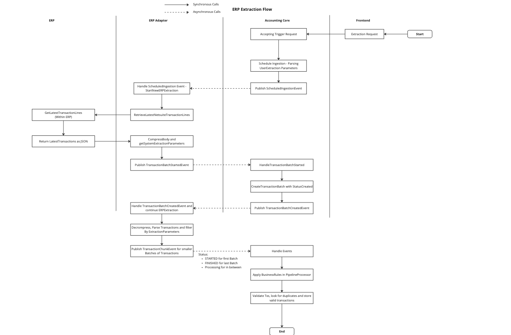
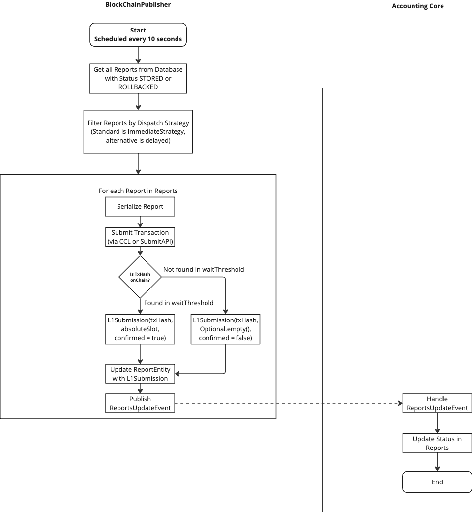
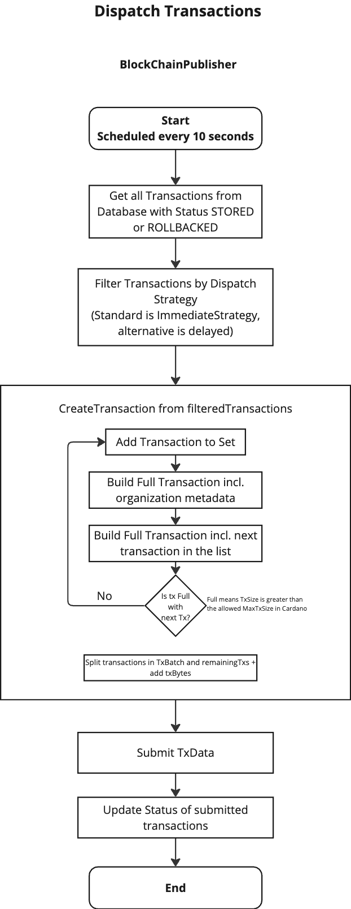

## Dataflow within the System

On this page, we will demonstrate the relevant dataflows within the system. 
Since it is a complex system, we will break it down into smaller parts and demonstrate which events are triggered in respective components.

### ERP extraction flow
The ERP extraction flow is triggered by the frontend. 
It is used to extract transaction for a specific period of time from the ERP system. 
These data will be stored in the database. 

    

### Blockchain Publishing
The blockchain publishing is the job which runs periodically within the `blockchain_publisher` module. 
Beforehand the `application_core` needs to approve reports and/or transactions and mark then as dispatchable.

#### Dispatching of Reports
Reports can be a balance sheet, income statement, or any other financial report.
The data of a report fits in one transaction, such that transaction chaining is not needed.

    

### Dispatching of Transactions
Since it can be an arbitrary number of transactions, the transactions are dispatched in batches.
The `blockchain_publisher` module will dispatch the transactions in batches, such that the Blocksize of the blockchain is used efficiently.

    

